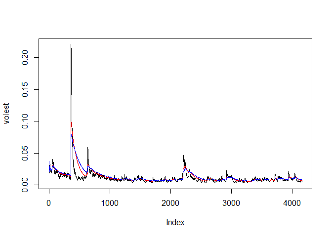

# Analyzing Stock Volatility
Johnny Quick  
July 3, 2016  

## Analyzing volatility of ABC stock 
## AmerisourceBergen Company


```r
#uncomment install package if not installed
#install.packages("tseries")
library(tseries)
```

```
## Warning: package 'tseries' was built under R version 3.3.1
```

```r
# get data for AmerisourceBergen Company starting with year 2000
ABCData <- get.hist.quote("abc", quote="Close", start = "2000-01-01")
```

```
## time series starts 2000-01-03
## time series ends   2016-07-01
```

```r
ABCRet <- log(lag(ABCData)) - log(ABCData)

# calculate volatility (standard deviation of ABCRet * sqrt(250) * 100)
## 250 is used because that is the approximate number of days the stock market is open
## multiplied by 100 to get percentage
ABCVol <- sd(ABCRet) * sqrt(250) * 100

# get volatility
ABCVol
```

```
## [1] 38.52948
```

```r
# create function to calculate volatility with weighting
Vol <- function(d, logrets){
        var = 0
        lam = 0
        varlist <- c()
        for (r in logrets) {
              lam = lam*(1 - 1/d) + 1
        var = (1 - 1/lam)*var + (1/lam)*r^2
                  varlist <- c(varlist, var)
        }
        sqrt(varlist)}

# weight of .9
volest <- Vol(10, ABCRet)
# weight of .5
volest2 <- Vol(50, ABCRet)
# weight of .2
volest3 <- Vol(80, ABCRet)
```

Looking at the plot below, the volatility starts out a little high, is lower for
many periods, then it spikes about 1600 periods in, goes back down, spikes
again around 2400 periods in, and then goes back down and remains steady
with low volatiility. As the weight goes down, the volatility follows.


```r
plot(volest, type = "l")
lines(volest2, type="l", col="red")
lines(volest3, type="l", col="blue")
```

<!-- -->
